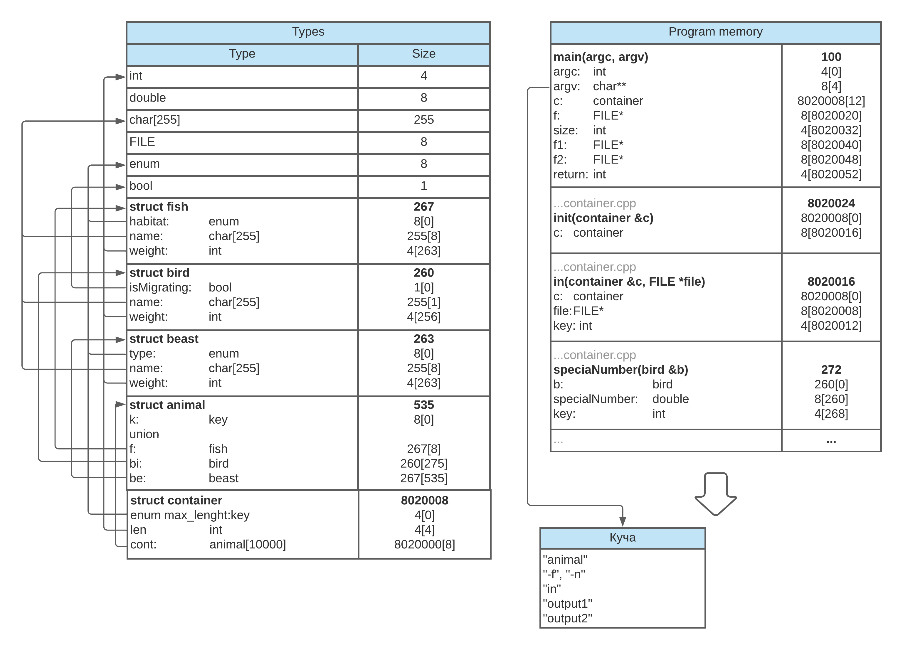

# Animals
### HW1 from the Computer Software Architecture course

## Variant 292 - task 12, sort 21
My given number was 292, which therefore resulted in me doing taks **#12
Animals** and sorting the elements by **#21** - delete those elements, which
have a special number less than the average special number of all
elements in the container. The remaining elements move to the beginning
of the container.

## Project description
The generalized artifact used in this project is
***animal***. It has several basic alternatives:
- ***fish*** - which contains an enum, indicating the habitat (river, sea, or lake)
- ***bird*** - which contains a private boolean field, indicating whether the bird
migrates in winter
- ***beast*** - which also has an enum, which specifies the type of food
that the beast ets (carnivore, herbivore, or omnivore)

### 

## Architecture
### File structure
The program is an example of the procedure base
architectural pattern. It is composed of the following files:

#### Header files [6]
    container.h
    animal.h
    fish.h
    bird.h
    beast.h
    rnd.h

#### Source files [6]
    main.cpp
    container.cpp
    animal.cpp
    fish.cpp
    bird.cpp
    beast.cpp

#### Memory
These files take 12.0kB. The compiled project file takes 92.8kB.

#### Memory allocation

#### Speed
The program takes from 0.000149 (for three elements) to 0.000598 (for 128 elements) seconds. 

#### Testing
Sample test files are included in the test folder.

