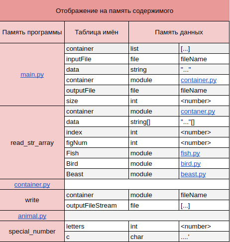

# Animals following dynamically typed language principles
### HW3 from the Computer Software Architecture course

## Variant 292 - task 12, sort 21
My given number was 292, which therefore resulted in me doing task **#12
Animals** and sorting the elements by **#21** - delete those elements, which
have a special number less than the average special number of all
elements in the container. The remaining elements move to the beginning
of the container.

## Project description
The project realizes the same functionality as HW2, but now uses a dynamically-typed
and garbage-collected language - python. The
animal base class is inherited by its descendants:
- ***fish*** - which contains an enum, indicating the habitat (river, sea, or lake)
- ***bird*** - which contains a private boolean field, indicating whether the bird
migrates in winter
- ***beast*** - which also has an enum, which specifies the type of food
that the beast ets (carnivore, herbivore, or omnivore)

## Architecture
### File structure
The program is an example of the dynamically-typed and garbage-collected
architectural pattern using python. It is composed of the following files:

    animal.py
    beast.py
    bird.py
    container.py
    extender.py
    fish.py
    main.py
    read_str_array.py

#### Memory
These files take 7,3kB. The compiled project file takes 116,5kB.

#### Memory allocation

#### Speed
The program takes from 0.00187 (for 128 elements) seconds. 

#### Testing
Sample test files are included in the test folder.

Here are some examples of command line arguments when running the program:

    -f ../tests/test01.txt ../results/output.txt
    -r ../tests/test01.txt ../results/output.txt

Please note that even when you will be using randomly generated data, you are required to
enter input and output file.

